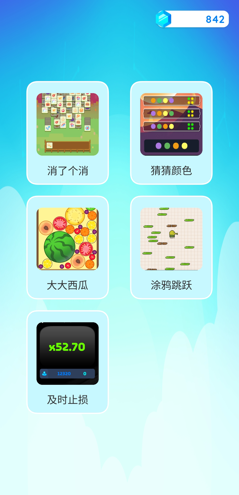
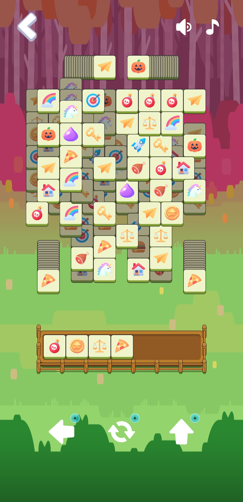
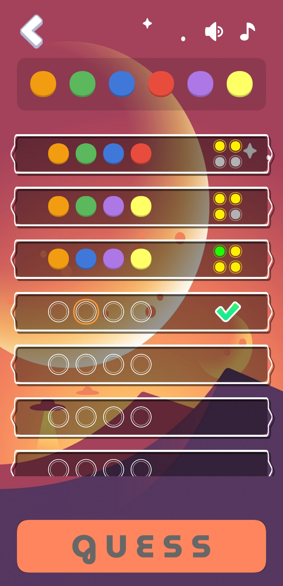
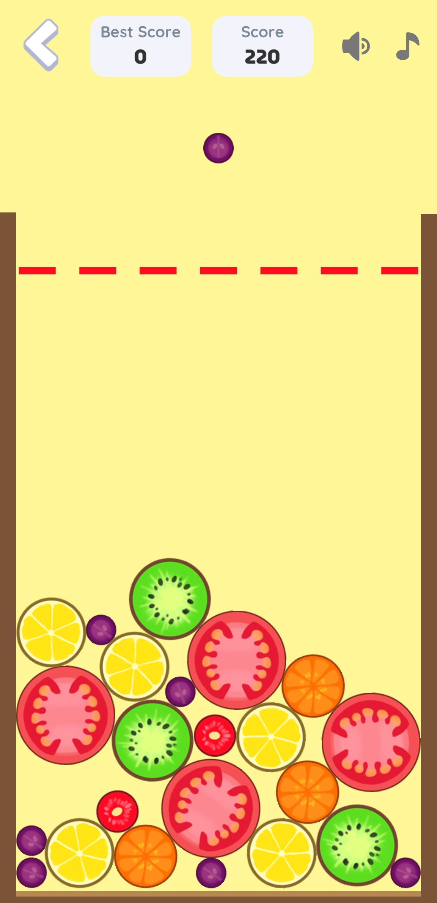
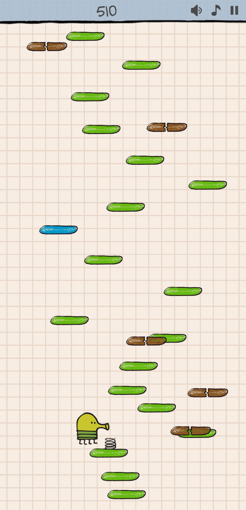
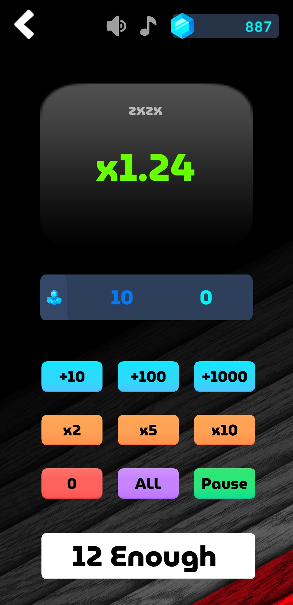

# MiniGames

## 游戏截图













## 羊了个羊

### 地图

json数据格式

```json
{
	"mapId":"8RRiaOnPWyXl",
	"rowNum":18,
	"colNum":15,
	"layerNum":7,
	"layerData":
	{
		"0":[
			{
				"blockId":"0-3-0",
				"row":3,
				"col":0
			}
		],
		"1":[{"blockId":"1-3-1","row":3,"col":1}],"2":[{"blockId":"2-3-5","row":3,"col":5}],"3":[{"blockId":"3-3-6","row":3,"col":6}],"4":[{"blockId":"4-3-10","row":3,"col":10}],"5":[{"blockId":"5-3-11","row":3,"col":11}],"6":[{"blockId":"6-3-14","row":3,"col":14}]
	}
}
```

撤回：50 刷新：200 拿出：500 复活：1000

### 新手

种类：4

组数：35-45（105-135）

层数：5-10

技能使用次数：撤回（999+0），刷新（2+8），拿出（2+8），复活（1+2）

奖励：10

### 简单

种类：6

组数：50-60（150-180）

层数：10-15

技能使用次数：撤回（2+8），刷新（1+4），拿出（1+4），复活（1+2）

奖励：50

### 中等

种类：9

组数：65-75（195-225）

层数：15-20

技能使用次数：撤回（1+4），刷新（1+2），拿出（1+2），复活（1+1）

奖励：200

### 困难

种类：12

组数：80-90（240-270）

层数：20-25

技能使用次数：撤回（1+2），刷新（1+1），拿出（1+1），复活（1+1）

奖励：500

### 专家

种类：15

组数：95-105（285-315）

层数：25-30

技能使用次数：撤回（0+2），刷新（0+1），拿出（0+1），复活（0+1）

奖励：1000

## 猜颜色

随机选择颜色，提示几个半对几个全对，看最后能不能猜出来。

可以让玩家选择挑战难度

颜色数量：6-8

猜测数量：4-6

颜色重复：是否

尝试次数：12-5

胜利的奖励

通关奖励 ：10

颜色种类奖励：*(颜色种类-5)

颜色数量奖励：*(颜色数量-3)

是否可以重复奖励：*5

尝试次数奖励：*（猜测数量*2+1-尝试次数）

## 合成大西瓜

## 涂鸦跳跃

平台生成算法

保证一定有解：任意两个可踩的平台之间的高度一定小于跳起高度

计算上升的高度

## 见好就收

赚钻石游戏，可能血亏，可能血赚。随时下注，及时收手。